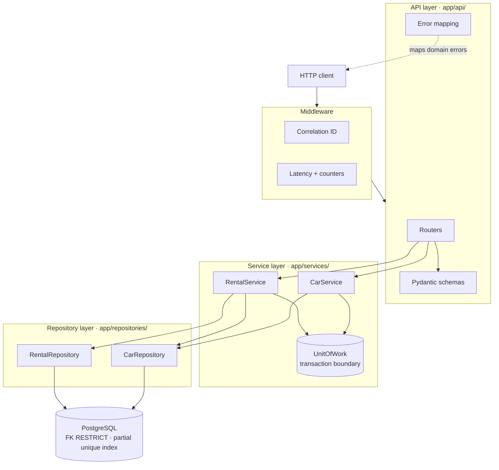
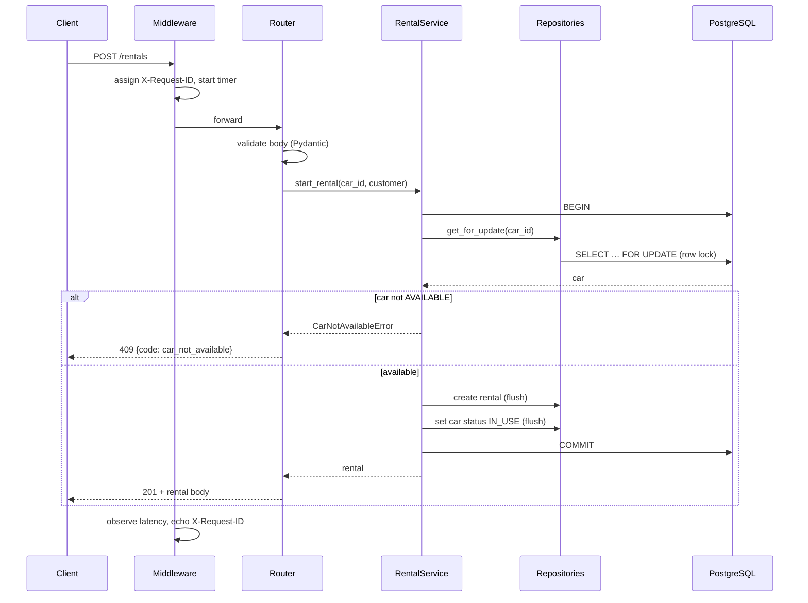
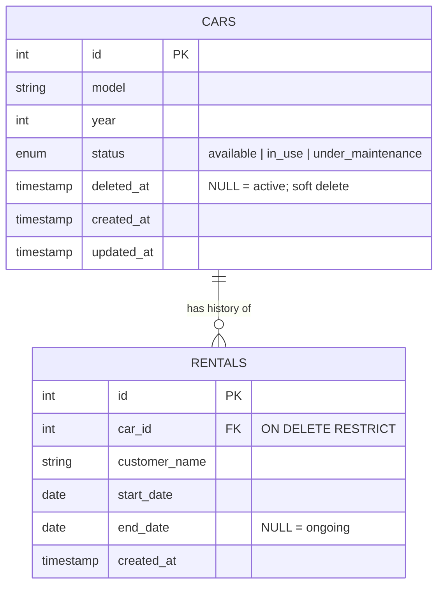
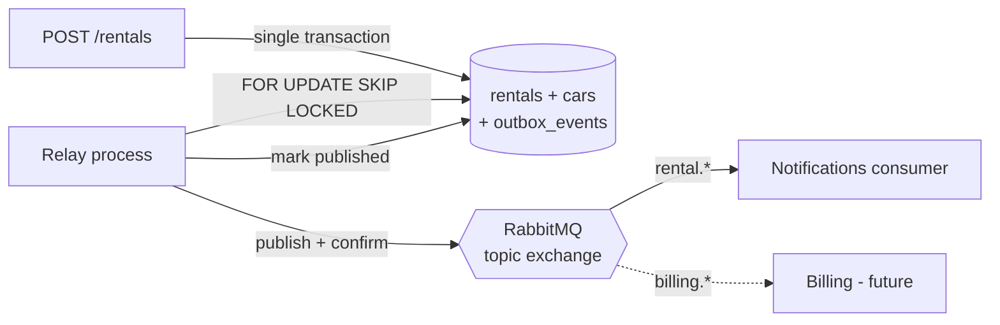

# DriveNow — Design Document

Companion to the [README](README.md). The README explains *how to run and
use* the system; this document explains *why it is built the way it is*,
and maps every assignment requirement to where it is implemented.

---

## 1. Requirement coverage

Each row points at the file(s) that satisfy it, so the mapping is
verifiable rather than asserted.

### Objectives

| # | Requirement | Status | Where |
|---|---|---|---|
| 0 | System architecture design | ✅ | This document, §2–3; README architecture diagram |
| 1 | Data access layer | ✅ | `app/repositories/` |
| 2 | Business logic layer | ✅ | `app/services/` |
| 3 | User interface (API or CLI) | ✅ | REST API — `app/api/`, OpenAPI at `/docs` |
| 4 | Logging and metrics | ✅ | `app/core/logging_config.py`, `app/core/metrics.py` |
| 5 | Basic documentation | ✅ | `README.md`, this file |

### Technical requirements

| # | Requirement | Status | Where |
|---|---|---|---|
| 1 | SQL or NoSQL DB, choice explained | ✅ | PostgreSQL — rationale in §4 |
| 1 | `cars` schema: id, model, year, status | ✅ | `app/models/car.py` |
| 1 | `rentals` schema: id, car_id, customer, start, end | ✅ | `app/models/rental.py` |
| 1 | Data access via an ORM | ✅ | SQLAlchemy 2.0 declarative ORM |
| 2 | Add a new car | ✅ | `POST /cars` → `CarService.add_car` |
| 2 | Update car details (e.g. status) | ✅ | `PATCH /cars/{id}` → `CarService.update_car` |
| 2 | List all cars, optional status filter | ✅ | `GET /cars?status=` → `CarService.list_cars` |
| 2 | Register a new rental | ✅ | `POST /rentals` → `RentalService.start_rental` |
| 2 | End rental, update car status | ✅ | `POST /rentals/{id}/end` → `RentalService.end_rental` |
| 3 | Python built-in `logging` module | ✅ | `app/core/logging_config.py` |
| 3 | Log critical actions | ✅ | add/update/retire, rental start/end, all domain errors |
| 3 | Console **and** file logging | ✅ | `StreamHandler` + `RotatingFileHandler` |
| 4 | Metrics via `prometheus_client` | ✅ | `app/core/metrics.py`, exposed at `/metrics` |
| 4 | Number of active cars | ✅ | `drivenow_active_cars` gauge |
| 4 | Number of ongoing rentals | ✅ | `drivenow_ongoing_rentals` gauge |
| 4 | Average operation response time | ✅ | `drivenow_http_request_duration_seconds` histogram — see §7 |
| 5 | Separation of layers | ✅ | §2; enforced by import direction |
| 5 | SOLID principles | ✅ | §6, with concrete mapping |
| 5 | Clean, readable, documented code | ✅ | Docstrings state *why*, not *what* |
| 5 | At least 4 unit tests | ✅ | **60 tests** across 6 files — §8 |
| 6 | Runs as a standalone Python application | ✅ | `uv run uvicorn app.main:app` |
| 6 | Dependency management | ✅ | `pyproject.toml` + `uv.lock` (§9) |
| 6 | `docker-compose.yml` | ✅ | App + PostgreSQL, healthcheck-gated |
| 7 | Public Git repository | ✅ | Hosted on GitHub |
| 7 | Clear commit messages, feature branch | ✅ | Scoped commits on `drivenow_branch` |
| — | Message queue communication *(optional)* | ✅ | Transactional outbox + RabbitMQ — §10 |

### Deliverables

| Requirement | Status | Notes |
|---|---|---|
| Full source code | ✅ | |
| README: architecture flow diagram | ✅ | ASCII in README, Mermaid in §2 |
| README: how to run | ✅ | Docker and local paths |
| README: how to use the API | ✅ | Endpoint table + `curl` examples |
| README: architecture description | ✅ | |
| README: example usage | ✅ | |
| README: screenshots *(recommended)* | ✅ | `docs/` — Swagger UI, metrics, broker, event flow |
| Link to Git repository | ✅ | GitHub |

**Beyond the brief** (each justified in the section noted): transactional
outbox with RabbitMQ (§10), CI pipeline (§9), PostgreSQL integration tests
covering concurrency (§8), soft deletes, correlation IDs, and readiness
probes.

---

## 2. Architecture



### Dependency direction

Imports point **downward only**:

- `app/api/` may import from `services`, `models`, `core`
- `app/services/` may import from `repositories`, `models`, `core` —
  **never** from `api`
- `app/repositories/` may import from `models`, `core` — never from
  `services` or `api`

This is what makes the business layer reusable. `RentalService` contains
no FastAPI import, so the same object can be driven by a CLI, a scheduled
job, or a queue consumer without modification. It is also why the queue
extension in §10 is additive rather than a rewrite.

### Layer responsibilities

| Layer | Owns | Explicitly does *not* own |
|---|---|---|
| API | HTTP semantics, validation, serialization, status codes | Business rules |
| Service | Business rules, transaction boundaries, orchestration | SQL, HTTP |
| Repository | Query construction, ORM session use | Rules, commits |
| Database | Invariants that must hold unconditionally | Application logic |

---

## 3. Request lifecycle

`POST /rentals` — the most interesting path, since it touches both tables:



Both writes sit inside one transaction. The lock is released at commit,
at which point a competing request reads `IN_USE` and is cleanly rejected.

---

## 4. Database choice

**PostgreSQL**, accessed through SQLAlchemy 2.0.

The deciding factor is that the system's central invariant —
*at most one ongoing rental per car* — is a **uniqueness constraint**, and
PostgreSQL can enforce it declaratively:

```sql
CREATE UNIQUE INDEX uq_one_active_rental_per_car
    ON rentals (car_id) WHERE end_date IS NULL;
```

That single line makes an inconsistent fleet state unrepresentable,
regardless of application bugs, concurrent requests, or someone running
an `INSERT` by hand.

| Considered | Why not |
|---|---|
| **MongoDB** | The data is relational (rental → car). Enforcing the one-active-rental rule would move into application code, which is where it is least reliable under concurrency. Multi-document transactions exist but are a heavier tool than a unique index. |
| **MySQL** | Workable, but has no partial (filtered) indexes. The invariant would need a nullable-column trick or a trigger — both less clear than the Postgres one-liner. |
| **SQLite** | Excellent for the test suite (and used there), but single-writer and no `SELECT … FOR UPDATE`, so it cannot back a concurrent service. |

**ORM:** SQLAlchemy 2.0 with typed `Mapped[]` declarative models — the
requirement is explicit about ORM-based access, and typed models catch
field errors at check time rather than at runtime.

---

## 5. Data model



Beyond the fields the assignment specifies, two columns were added
deliberately:

- **`cars.deleted_at`** — rentals are financial history that reference the
  vehicle. A hard delete would destroy that history, so "delete" retires
  the car instead. The FK is `RESTRICT`, so the database refuses a hard
  delete even if application code attempts one.
- **`created_at` / `updated_at`** — basic auditability; effectively free
  and impossible to backfill later.

**`end_date IS NULL` as the "ongoing" marker** is a deliberate choice: it
is what the partial unique index keys on, so *ongoing* rentals are
constrained while historical ones are not. The tradeoff is that the schema
cannot express a *planned* return date distinct from the *actual* one. For
a real system I would split these into `expected_end_date` and
`returned_at`; I kept the assignment's stated schema instead of
unilaterally expanding it.

---

## 6. SOLID in practice

Mapped to specific code rather than asserted generally.

**Single responsibility.** Each layer has one reason to change.
Repositories change when queries change; services when rules change;
routers when the HTTP contract changes. The clearest evidence: adding the
soft-delete feature touched the model, repository, and service — but not
a single route handler.

**Open/closed.** Two extension points are closed to modification:
- Adding a domain error means adding one entry to `_STATUS_BY_TYPE` in
  `app/api/errors.py`. No handler is edited.
- New endpoints are instrumented automatically by `MetricsMiddleware`;
  latency tracking is not something a developer can forget to add.

**Liskov substitution.** Domain exceptions form a hierarchy
(`CarNotFoundError` → `NotFoundError` → `DomainError`). The error handler
matches on base classes via `isinstance`, so any new subclass is handled
correctly without the handler knowing it exists.

**Interface segregation.** Repositories are per-aggregate and narrow.
`CarService` receives a `RentalRepository` but uses only
`get_active_for_car` — a genuinely minimal dependency, rather than one
fat `DatabaseRepository` that every service would depend on wholesale.

**Dependency inversion.** Services receive their collaborators through
the constructor and never construct a `Session` or import
`SessionLocal`. Wiring lives entirely in `app/api/deps.py`, which is why
tests can build a `CarService` against SQLite with no patching or
mocking.

> **Honest caveat:** services depend on *concrete* repository classes
> rather than `typing.Protocol` interfaces. Constructor injection already
> delivers the substitutability benefit that matters here (tests swap the
> backing database freely), and at two repositories the extra indirection
> would be ceremony. If a second data source appeared — a cache, an
> external fleet API — that is the point at which I would extract
> `CarRepositoryProtocol`, and nothing above the repository layer would
> need to change.

---

## 7. Observability

### Logging

Python's built-in `logging`, configured once at startup:

- **Console** (`StreamHandler`) and **file** (`RotatingFileHandler`,
  5 MB × 3) — both required by the assignment
- Every line carries a **request correlation ID**, taken from an inbound
  `X-Request-ID` if a proxy supplies one, generated otherwise, and echoed
  in the response. This is what makes a single request traceable across
  API, service, and repository lines.
- The ID lives in a `ContextVar`, not a global, so concurrent requests
  never read each other's value.
- `LOG_JSON=true` switches to one JSON object per line for aggregators.

Logged actions: car added / updated / retired, rental started / ended,
rental rejected, race lost, every domain error, every unhandled exception
with stack trace.

### Metrics

| Metric | Type | Requirement satisfied |
|---|---|---|
| `drivenow_active_cars` | Gauge | "number of active cars" |
| `drivenow_ongoing_rentals` | Gauge | "number of ongoing rentals" |
| `drivenow_http_request_duration_seconds` | Histogram | "average response time" |
| `drivenow_fleet_size` | Gauge | operational context |
| `drivenow_http_requests_total` | Counter | throughput, error rate |
| `drivenow_domain_errors_total` | Counter | business-rule violations by code |

**On "average response time":** a histogram is used rather than a plain
average, because a stored mean cannot be re-aggregated across instances
or time windows, and hides the tail latency that actually matters. The
average is derived at query time:

```promql
rate(drivenow_http_request_duration_seconds_sum[5m])
  / rate(drivenow_http_request_duration_seconds_count[5m])
```

and the same data yields p95 via `histogram_quantile`, which an average
alone cannot.

**Two implementation details worth noting:**
- Metrics are labelled by **route template** (`/cars/{car_id}`), never the
  raw path. Labelling by raw path would make every ID its own label value
  and explode Prometheus cardinality.
- Gauges are recomputed from `COUNT(*)` at scrape time rather than
  incremented, so they cannot drift out of sync with the database.

---

## 8. Testing strategy

60 tests across six files, each targeting a different failure class. The
assignment asks for four; the count is a consequence of testing the
concurrency and transaction guarantees, not padding.

| File | Tests | Targets |
|---|---|---|
| `test_car_service.py` | 10 | Vehicle rules, partial updates, history preservation |
| `test_rental_service.py` | 13 | Rental lifecycle, status transitions, rollback |
| `test_api.py` | 17 | Status-code mapping, validation, serialization, correlation IDs |
| `test_constraints.py` | 4 | Database invariants, asserted by bypassing the service |
| `test_outbox.py` | 13 | Event atomicity, relay retry/dead-letter, idempotency |
| `test_integration_postgres.py` | 3 | Real concurrency, partial index, JSONB *(marked `integration`)* |

Three deserve specific mention:

- **`test_failed_rental_leaves_no_partial_state`** — the regression guard
  for the transaction boundary. A rejected rental must leave neither an
  orphan rental row nor a mutated car status.
- **`test_double_booking_is_impossible_at_db_level`** — writes directly
  through the session, deliberately bypassing every application check, to
  prove the guarantee holds even when the service layer does not.
- **`test_end_rental_does_not_override_maintenance`** — a car flagged for
  maintenance mid-rental must not be silently released back into the
  available pool when the rental ends.

Tests run against in-memory SQLite (foreign keys enabled via `PRAGMA`),
so the suite needs no Docker and finishes in under a second.

**The row-locking gap is now closed.**
`test_concurrent_rentals_yield_exactly_one_winner` runs two threads on
independent PostgreSQL connections, released simultaneously by a barrier,
both attempting to rent the same car. Exactly one must win; the loser must
be rejected cleanly, leave no second active rental, and leave no orphan
event. This is the test SQLite cannot run, and it is why the suite is
split:

```bash
make test     # SQLite, no services, sub-second — the everyday loop
make itest    # real PostgreSQL, concurrency and dialect-specific behaviour
```

Integration tests are deselected by default (`-m 'not integration'`), so
the fast suite needs nothing running. CI executes both.

---

## 9. Environment and dependencies

- **Standalone application**: `uv run uvicorn app.main:app`
- **Dependency management**: `pyproject.toml` declares compatibility
  ranges; `uv.lock` pins every dependency **including transitive ones**,
  with hashes. A pinned `requirements.txt` constrains only direct
  dependencies — `fastapi==0.115.0` still lets `starlette` drift between
  builds. An exported `requirements.txt` is kept as a pip fallback.
- **`docker-compose.yml`**: PostgreSQL with a healthcheck; the app waits
  on it, runs `alembic upgrade head`, then serves.
- **Container hardening**: multi-stage build (no compiler or uv in the
  runtime image), non-root user, `HEALTHCHECK` instruction.
- **Schema ownership**: Alembic migrations, not `create_all()`. Startup
  verifies connectivity and fails fast rather than mutating schema.
- **Probes**: `/health/live` for the restart policy; `/health/ready`
  performs a real database round-trip and returns 503 on failure.
- **Code style**: `ruff format` — a reimplementation of Black that
  produces near-identical output. Since ruff already handles linting and
  import sorting, adding Black (or isort, or flake8) alongside it would be
  a second tool doing the same job with its own config to keep in sync.
  One tool, one config block in `pyproject.toml`.
- **Pre-commit hooks** (`.pre-commit-config.yaml`), staged by cost: lint,
  format, lockfile sync, and hygiene checks on **commit**; the test suite
  on **push**. Running tests on every commit trains people to use
  `--no-verify`, which defeats the hooks entirely. Two project-specific
  hooks earn their place: `uv-lock` (a dependency added to
  `pyproject.toml` but never locked passes review and then fails the
  `--frozen` Docker build) and `check_single_head.py` (merged branches
  each adding a migration produce two Alembic heads, which stays silent
  until someone runs `upgrade head`).
- **CI** (`.github/workflows/ci.yml`): three jobs — lint + unit tests;
  integration tests against a real PostgreSQL service container, which
  also proves the migrations apply cleanly; and a Docker image build.
  `uv sync --frozen` makes CI fail if `uv.lock` is stale, so a drifted
  lockfile cannot be merged. CI re-checks formatting and the migration
  graph independently of the hooks — hooks are a convenience for
  contributors, not an enforcement mechanism, since anyone can skip them.
- **Compose topology**: migrations run as a dedicated one-shot `migrate`
  service that the others wait on, rather than three containers racing to
  apply the same migration on startup.

---

## 10. Message queue — transactional outbox

Implemented. RabbitMQ, with a transactional outbox rather than direct
publishing, because the obvious implementation is quietly wrong.

### Why not publish directly

```python
with self.uow:
    rental = self.rental_repo.create(...)
    self.car_repo.apply_changes(car, status=IN_USE)
publisher.publish("rental.started", rental.id)   # ← unsafe
```

If the process dies between `COMMIT` and `publish`, the rental exists and
billing never hears about it. Moving the publish *inside* the transaction
is worse: a rollback would leave an event announcing a rental that does
not exist. Neither ordering is safe, because two systems cannot be
committed atomically.

### The outbox

Write the event to a table **in the same transaction** as the business
data. One database, one transaction, so both commit or neither does:



| Component | File | Role |
|---|---|---|
| Event definitions | `app/services/events.py` | Typed event contract |
| Outbox table | `app/models/outbox.py` | `outbox_events`, `processed_events` |
| Staging | `app/repositories/outbox_repository.py` | Write in-transaction; claim batches |
| Publisher | `app/messaging/publisher.py` | `EventPublisher` Protocol + 3 impls |
| RabbitMQ | `app/messaging/rabbitmq.py` | Topic exchange, publisher confirms |
| Relay | `app/relay/relay.py` | Poll → publish → mark |
| Consumer | `app/consumers/notifications.py` | Idempotent example consumer |

### Guarantees and their costs

**At-least-once delivery.** If the relay dies after publishing but before
marking the row, the event is republished. There is no way to make this
exactly-once across two systems, so consumers deduplicate on `event_id`
via the `processed_events` ledger.

**No event without its fact, no fact without its event.** Asserted by
`test_rejected_rental_writes_no_event`: a rejected rental leaves no
`rental.started` row behind.

**Broker outages do not lose events.** A failed publish increments
`attempts` and leaves the row `PENDING`. After `outbox_max_attempts` it is
marked `FAILED` (dead-lettered) rather than retried forever. The relay
also *stops the batch* on the first failure — if the broker is down, the
remaining events would fail too, and continuing would burn their retry
budget for nothing.

**Publisher confirms are enabled.** Without them, `basic_publish` returns
successfully for a message the broker never accepted, and the relay would
mark it published. That is a silent-loss bug that only appears under load.

**Multiple relay instances are safe.** `SELECT … FOR UPDATE SKIP LOCKED`
means a second worker skips rows the first has claimed rather than
blocking or double-publishing.

### Deliberate tradeoffs

- **Polling, not `LISTEN/NOTIFY`.** A 1-second poll adds up to a second of
  latency. `LISTEN/NOTIFY` would cut that but adds a connection-liveness
  concern and is Postgres-specific; polling is simpler and adequate here.
- **Global ordering is not guaranteed with multiple relay workers.**
  Events are published in id order per worker, but two workers interleave.
  Per-aggregate ordering would require partitioning the claim query by
  `aggregate_id`. Not needed for these consumers; noted so the limitation
  is explicit rather than accidental.
- **The `processed_events` ledger lives in the application database.**
  In production each consumer owns its own store, so its bookkeeping
  cannot couple to the producer's schema. Colocated here to keep the
  exercise to one database.

### Observability

`drivenow_outbox_pending` is the key alert signal: a rising pending count
means the relay is down or the broker is unreachable, and it is visible
before any consumer notices missing events. Also exposed:
`drivenow_outbox_failed` (dead letters), plus published/failed counters
and publish latency.

---

## 11. Known limitations

Stating these is deliberate: knowing where the boundaries are is part of
the design.

- **No authentication or authorization.** Every caller is trusted.
  Out of scope for the exercise; first addition for a real internal tool.
- **No idempotency keys** on `POST /rentals`. A client retry after a
  timeout could create a second rental.
- **No rate limiting.**
- **The broker path has no automated test.** The relay is covered through
  an in-memory publisher, so its retry, dead-letter and idempotency
  behaviour is asserted — but the RabbitMQ publisher and the notifications
  consumer are only exercised by hand against `docker compose`. Asserting
  real delivery means polling a live queue for an asynchronous result,
  which belongs in a separate marked suite rather than the sub-second one.
  Untested seams between a producer and a broker are where routing and
  topology mistakes hide.
- **Relay ordering** is not globally guaranteed across multiple workers (§10).
- **Consumer idempotency ledger** shares the producer's database (§10).
- **`end_date` conflates planned and actual return** (§5).
- **Metrics are per-process.** Under multiple uvicorn workers each holds
  its own registry; `prometheus_client`'s multiprocess collector would be
  the fix.
- **Offset pagination** degrades on large offsets; keyset pagination
  would be the fix at fleet scale.
- **No pricing or overdue detection** — the obvious next domain concepts.
