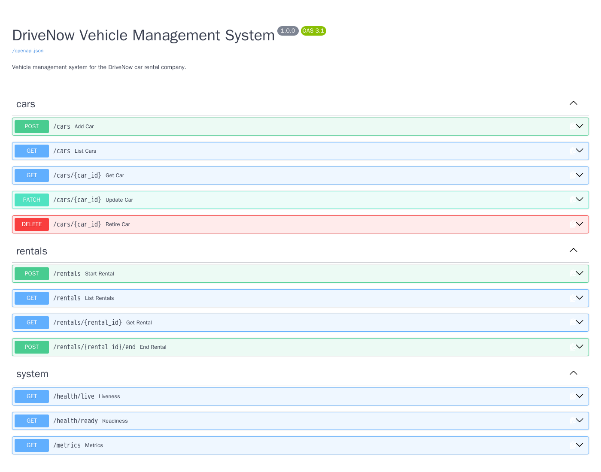
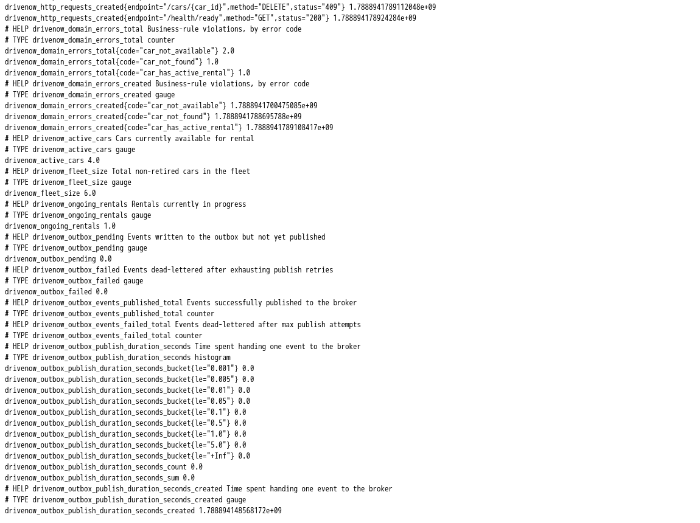
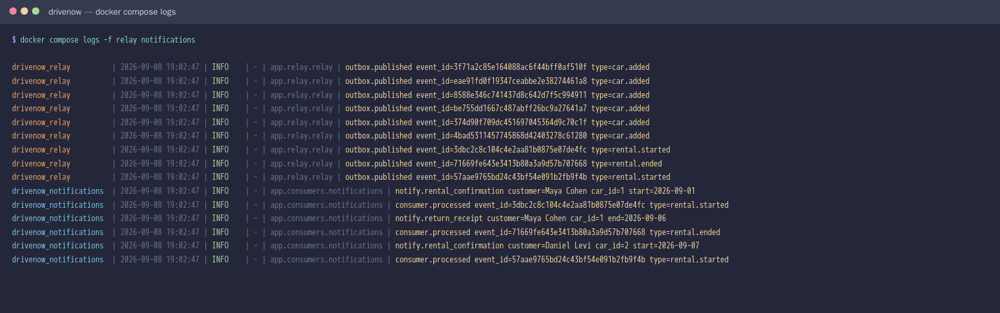

# DriveNow — Vehicle Management System

A Python/FastAPI service for managing a car rental fleet: vehicle
lifecycle, rental registration, and vehicle status tracking.

Built with an emphasis on **correctness under concurrency** and **clean
layer boundaries**, so the system can grow without the business rules
leaking into HTTP handlers or the database schema.

> **[DESIGN.md](DESIGN.md)** documents the architecture in depth, maps
> every assignment requirement to its implementation, and records the
> tradeoffs and known limitations.

---

## Architecture

```
                    HTTP request
                         │
        ┌────────────────▼─────────────────┐
        │           Middleware              │  correlation ID, latency metrics
        └────────────────┬─────────────────┘
                         │
        ┌────────────────▼─────────────────┐
        │           API layer               │  app/api/
        │  routers · Pydantic schemas       │  validation, serialization
        │  centralized error mapping        │  domain error → HTTP status
        └────────────────┬─────────────────┘
                         │
        ┌────────────────▼─────────────────┐
        │         Service layer             │  app/services/
        │  business rules · UnitOfWork      │  owns the transaction boundary
        └────────────────┬─────────────────┘
                         │
        ┌────────────────▼─────────────────┐
        │       Repository layer            │  app/repositories/
        │  SQLAlchemy queries · flush()     │  never commits
        └────────────────┬─────────────────┘
                         │
        ┌────────────────▼─────────────────┐
        │           PostgreSQL              │  constraints as the last line
        │  FK RESTRICT · partial unique idx │  of defence
        │  + outbox_events                  │
        └────────────────┬─────────────────┘
                         │ polled
        ┌────────────────▼─────────────────┐
        │        Outbox relay (process)     │  publishes committed events
        └────────────────┬─────────────────┘
                         ▼
                 RabbitMQ ──► consumers (notifications, …)
```

The synchronous path ends at the database. Events reach the broker via a
separate relay process, so a slow or unavailable broker can never add
latency to — or fail — an API request.

Each layer depends only on the one below it. The service layer never
imports FastAPI; the repository layer never raises HTTP errors. That
boundary is what makes the business rules reusable behind a CLI, a queue
consumer, or a scheduled job without modification.

### Why PostgreSQL

The domain is relational: a rental references exactly one car, and the
core invariant ("at most one ongoing rental per car") is a *uniqueness*
constraint. PostgreSQL can enforce that invariant declaratively via a
**partial unique index**, and provides row-level locking (`SELECT … FOR
UPDATE`) to serialize competing rental attempts. A document store would
push both of those into application code, which is exactly where they
are least reliable.

---

## Design decisions

Each of these is argued in full — with the alternatives considered and
the costs accepted — in **[DESIGN.md](DESIGN.md)**. In brief:

1. **Transaction boundaries live in the service layer.** Repositories
   `flush()` but never `commit()`: a repository cannot know whether it is
   the whole operation or one step of five. Starting a rental writes the
   rental, the car's status and the outbox event in one `UnitOfWork` —
   all three commit, or none do. *(§2, §3)*

2. **Double-booking is prevented at three levels** — a status check for
   the ordinary case, `SELECT … FOR UPDATE` for concurrent requests, and
   a partial unique index on `(car_id) WHERE end_date IS NULL` that makes
   two ongoing rentals for one car unrepresentable. *(§4)*

3. **Cars are retired, not deleted.** Rentals are financial history
   pointing at the vehicle, so `DELETE /cars/{id}` sets `deleted_at`; the
   foreign key is `ON DELETE RESTRICT` so the database refuses a hard
   delete regardless. *(§5)*

4. **Errors map to HTTP in exactly one place.** Domain exceptions carry
   business meaning and no status codes; `app/api/errors.py` owns the
   translation, so route handlers contain no `try`/`except`. *(§6)*

5. **Ending a rental respects intervening state.** A car returns to
   `available` only if it is still `in_use` — one flagged for maintenance
   mid-rental stays in maintenance. *(§5)*

6. **Events use a transactional outbox, not direct publishing.** The
   event is written in the same transaction as the rental and published
   afterwards by a separate relay, because a database and a broker cannot
   be committed atomically. Delivery is at-least-once, so consumers
   deduplicate on `event_id`. *(§10)*

7. **Dependencies are locked, not just pinned.** `uv.lock` pins every
   transitive dependency with hashes; the Docker build runs
   `uv sync --frozen`, so an image cannot be built from an unpinned
   dependency set. *(§9)*

---

## Project structure

```
app/
  core/          config, engine + UnitOfWork, logging, metrics, middleware
  models/        SQLAlchemy models, indexes, and constraints
  repositories/  data access (queries only, no commits)
  services/      business rules, transaction boundaries, domain exceptions
  api/           routers, schemas, dependency wiring, error mapping
  messaging/     EventPublisher protocol + RabbitMQ implementation
  relay/         outbox relay process — publishes committed events
  consumers/     example downstream consumer (notifications)
  main.py        application assembly
alembic/         versioned schema migrations
scripts/         demo seeding, migration-head check
tests/           service, API, database-constraint, and outbox tests
docs/            README screenshots
```

---

## Running the project

### Docker (recommended)

```bash
docker compose up --build        # or: make up
```

Starts six services: PostgreSQL, RabbitMQ, a one-shot `migrate` job, the
API, the outbox relay, and an example notifications consumer. Migrations
run as their own unit that the others wait on, so containers never race to
apply the same migration.

To see the whole pipeline work end to end:

```bash
docker compose exec api python -m scripts.seed     # create demo fleet + rentals
docker compose logs -f relay notifications         # watch events flow
```

| | |
|---|---|
| API + Swagger UI | http://localhost:8000/docs |
| Liveness | http://localhost:8000/health/live |
| Readiness (checks DB) | http://localhost:8000/health/ready |
| Metrics | http://localhost:8000/metrics |
| RabbitMQ management UI | http://localhost:15672 (drivenow / drivenow) |

### Screenshots

**Swagger UI** — every endpoint, generated from the route signatures.



**Metrics** — the fleet gauges, domain-error counters, and outbox depth
that `/metrics` exposes to Prometheus.



**The event pipeline** — seeding writes to the outbox; the relay
publishes each event to RabbitMQ; the notifications consumer handles it
and records the `event_id` so a redelivery is a no-op.



### Local development

Dependencies are managed with [uv](https://docs.astral.sh/uv/). Install it
once (`curl -LsSf https://astral.sh/uv/install.sh | sh`), then:

```bash
make install                # .venv + dependencies + git hooks
cp .env.example .env

docker run -d -p 5432:5432 \
  -e POSTGRES_USER=drivenow -e POSTGRES_PASSWORD=drivenow \
  -e POSTGRES_DB=drivenow postgres:16-alpine

uv run alembic upgrade head
uv run uvicorn app.main:app --reload
```

Common tasks are wrapped in the `Makefile`: `make test`, `make lint`,
`make migrate`, `make run`, `make up`.

**Without uv:** `docker compose up --build` needs nothing but Docker, and
is the path this project is tested on.

### Tests

```bash
make test                   # 59 unit tests, SQLite, no services needed (3 more need Postgres)
make cov                    # with coverage report
make itest                  # integration tests against real PostgreSQL
make lint                   # lint + formatting check
make format                 # autofix and reformat
make check                  # everything CI runs, locally
```

**Code style** is enforced by `ruff format` (a Black-compatible
formatter) and `ruff check`, wired into pre-commit hooks. Formatting and
linting run on every commit; the test suite runs on push. `make install`
sets both up; `make hooks` runs everything against all files.

CI runs all three on every push (`.github/workflows/ci.yml`), plus a
Docker image build.

Unit tests use in-memory SQLite and need nothing running. The
concurrency guarantees that SQLite cannot express — row locking under a
genuine race — are covered by `make itest` against real PostgreSQL, where
two threads on separate connections race for the same car and exactly one
must win.

---

## Schema

**cars** — `id`, `model`, `year`, `status`, `deleted_at`, `created_at`, `updated_at`
One partial index on `(status, id) WHERE deleted_at IS NULL` — the shape
every car query takes: live rows, optionally narrowed by status, ordered
by id.

**rentals** — `id`, `car_id` → cars.id `RESTRICT`, `customer_name`, `start_date`, `end_date`, `created_at`
`end_date IS NULL` means ongoing. Partial unique index on `car_id` where
`end_date IS NULL`; check constraint `end_date >= start_date`.

---

## API

| Method | Path | Notes |
|---|---|---|
| `POST` | `/cars` | 201. Starts `available`. |
| `GET` | `/cars` | `?status=`, `?limit=`, `?offset=`. Excludes retired. |
| `GET` | `/cars/{id}` | 404 if missing or retired. |
| `PATCH` | `/cars/{id}` | Partial; omitted fields untouched. 409 on a status change the rental lifecycle owns. |
| `DELETE` | `/cars/{id}` | 204. Soft delete; 409 during an active rental. |
| `POST` | `/rentals` | 201. 409 if car unavailable. |
| `GET` | `/rentals` | `?active_only=true`, paginated. |
| `GET` | `/rentals/{id}` | 404 if missing. |
| `POST` | `/rentals/{id}/end` | Closes rental, releases car. 400 if `end_date` precedes the start. |

```bash
# Add a car
curl -X POST localhost:8000/cars \
  -H 'Content-Type: application/json' \
  -d '{"model": "Tesla Model 3", "year": 2023}'

# Start a rental
curl -X POST localhost:8000/rentals \
  -H 'Content-Type: application/json' \
  -d '{"car_id": 1, "customer_name": "Jane Doe"}'

# End it
curl -X POST localhost:8000/rentals/1/end \
  -H 'Content-Type: application/json' -d '{}'

# Filter
curl 'localhost:8000/cars?status=available&limit=20'
```

Errors are consistently shaped:
```json
{ "detail": "Car id=1 is not available (current status: in_use)",
  "code": "car_not_available" }
```

---

## Observability

**Logging** — console + rotating file (5 MB × 3). Every line carries a
**request correlation ID**, so one API call can be traced across all
layers. The ID is taken from an inbound `X-Request-ID` when a proxy
supplies one, generated otherwise, and echoed back in the response.
Set `LOG_JSON=true` for structured output.

```
2026-09-08 14:22:01 | INFO | a3f9c2e18b04 | app.services.rental_service | rental.started id=7 car_id=3 customer=Jane Doe
```

**Metrics** — Prometheus at `/metrics`.

| Metric | Type |
|---|---|
| `drivenow_active_cars` | Gauge |
| `drivenow_fleet_size` | Gauge |
| `drivenow_ongoing_rentals` | Gauge |
| `drivenow_http_request_duration_seconds` | Histogram |
| `drivenow_http_requests_total` | Counter |
| `drivenow_domain_errors_total` | Counter (by error code) |
| `drivenow_outbox_pending` | Gauge — key alert signal for the async path |
| `drivenow_outbox_failed` | Gauge — dead-lettered events |
| `drivenow_outbox_events_published_total` | Counter (by event type) |
| `drivenow_outbox_publish_duration_seconds` | Histogram |

Latency is captured by middleware rather than per-handler boilerplate, so
a new endpoint is instrumented automatically. Metrics are labelled by
**route template** (`/cars/{car_id}`), never the raw path — labelling by
raw path would make every ID a distinct label value and explode
Prometheus cardinality.

Gauges are refreshed from `COUNT(*)` queries at scrape time, so they
cannot drift from the database the way incremented counters can.

---

## Operational notes

- **Migrations**: schema is owned by Alembic, not `create_all()`. Startup
  verifies connectivity and fails fast rather than mutating the schema.
- **Container**: multi-stage build (no compiler in the runtime image),
  runs as a non-root user, with a `HEALTHCHECK`.
- **Probes**: `/health/live` for restart policy; `/health/ready` performs
  a real database round-trip and returns 503 when it fails — a liveness
  probe that ignores the DB reports healthy while every request 500s.
- **Pagination** is bounded by `max_page_size`, so `?limit=999999` is
  rejected with 422 instead of attempting a full table scan.

---

## What I would do next

- **Per-aggregate event ordering**, if a consumer ever needs it — the
  relay currently guarantees order per worker, not globally.
- **`LISTEN/NOTIFY`** to cut the relay's poll latency, if sub-second event
  delivery becomes a requirement.
- **Authentication and authorization**; currently every caller is trusted.
- **Rental pricing and overdue detection**, the obvious next domain
  concepts once rentals have real date semantics.
- **Idempotency keys** on `POST /rentals`, so a client retry after a
  timeout does not create a second rental.
